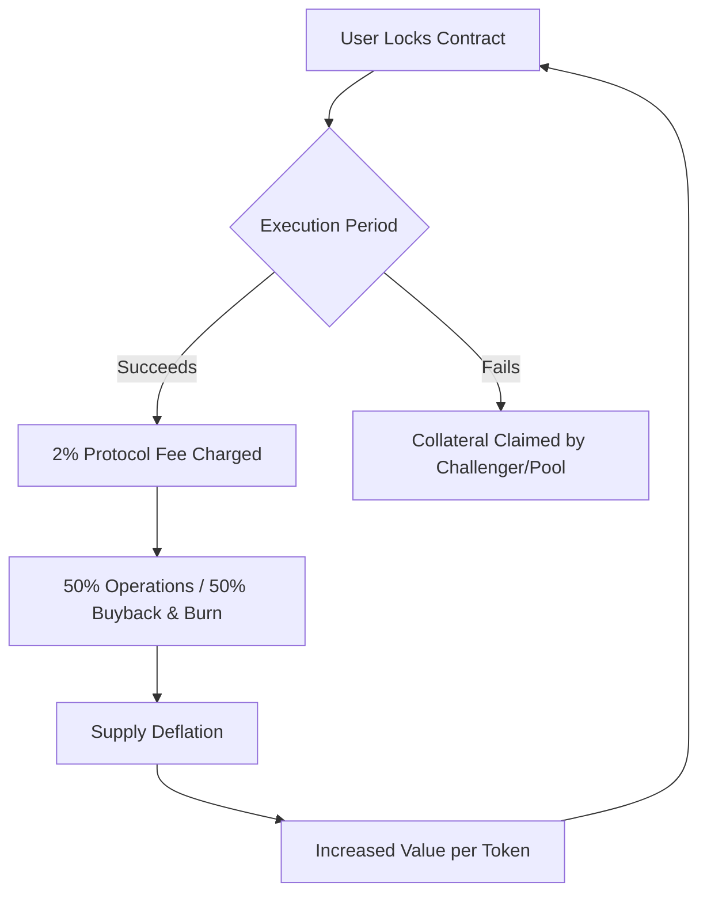

# $CLTR: The Currency of Conviction
*Vision Manifesto and Strategic Framework for the Collateral Reputation Economy*

---

## 1. The Core Shift: Prediction vs. Conviction

Prediction markets (Polymarket, etc.) are passive and speculative. People bet on *external events* they cannot control. 

**Collateral ($CLTR) is the opposite: it is an active Execution Market.**
*   It is the world's first **Reputation Economy** where individuals put capital behind their own promises.
*   **The Narrative**: *"Don't tell me what you will do. Show me what you're willing to risk."*
*   **The Enemy**: Empty promises, fake status, unbacked influencer growth, and talk without skin in the game.

---

## 2. The Tokenomics Flywheel (Proof-of-Success)

Unlike traditional tokens that burn arbitrarily, `$CLTR` introduces the **Proof-of-Success Burn**. The token's value is directly tied to positive human achievement.

Every goal completed burns supply. **The token literally benefits from human execution.**

---

## 3. Product Features & The Social Loop

### A. Credibility Profiling
Users build an immutable performance record on-chain. `$CLTR` acts as the utility catalyst:
*   **Performance Metrics**: Displayed as raw, undisputable stats: *Contracts Completed*, *Success Rate*, and *Total Capital Risked*.
*   **Utility**: Staking `$CLTR` boosts your profile visibility, verifies identity, and unlocks higher-value contract tiers.

### B. Creator Economy & The Viral Loop
Creators lock goals publicly (e.g., *"I will ship this software version in 30 days"*). 
*   **Backers vs. Challengers**: The community stakes `$CLTR` to back or challenge.
*   **Content Generation**: The contract automatically creates milestone content (Day 1: Locked, Day 15: Progress update, Day 30: Win/Loss). This creates a self-propelling viral loop on social media.

### C. Rivalry Mode (Peer-to-Peer Combat)
Two creators/executors challenge each other head-to-head. Both lock stakes. The community watches and votes on verification. The winner takes the pool, the performance points, and `$CLTR` rewards.

---

## 4. Refined Tokenomics Structure

To achieve the **40% to 50% Community allocation** for maximum network effects, we propose adjusting the distributions:

| Allocation Category | Previous % | Proposed % | Strategy |
| :--- | :--- | :--- | :--- |
| **Community Rewards** | 30.00% | **45.00%** | Allocated for first users, top executors, best creators, and active verifiers. |
| **Founder Direct** | 6.66% | **6.66%** | Retained (Unlocked). Founder skin in the game. |
| **Founder Vesting** | 5.00% | **5.00%** | Retained (Locked, 1-year cliff, 4-year linear). |
| **Liquidity Wallet** | 15.00% | **15.00%** | Standard AMM seeding (locked/burned LP NFT). |
| **Treasury Multisig** | 8.34% | **8.34%** | Retained for strategic operations and partnerships. |
| **Strategic & Team** | 25.00% | **10.00%** | Consolidated allocation for team and strategic advisors. |
| **Verifier Pool** | 10.00% | **10.00%** | Retained to incentivize honest, decentralized contract verification. |
| **Total** | **100%** | **100%** | **1,000,000,000 $CLTR fixed supply.** |
